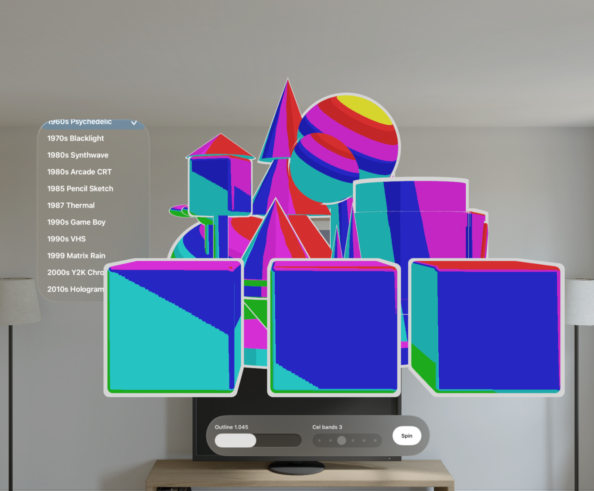
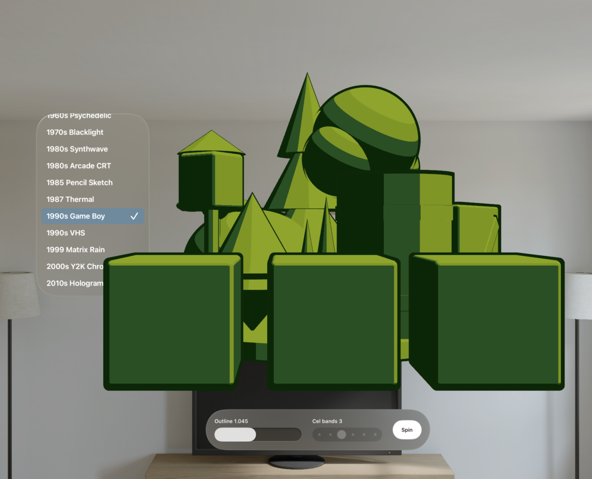
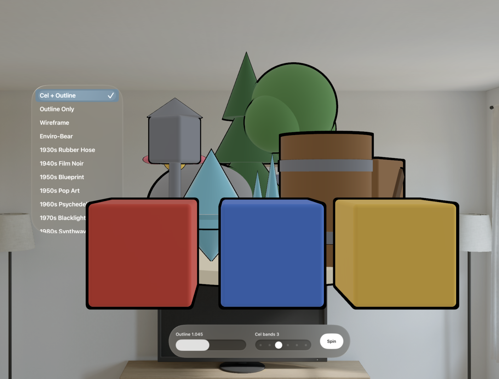

# DicyaninToonShader

Cel / toon shading with a black inverted-hull outline for RealityKit on Apple Vision Pro. Flag entities with a component, call one manager method, and the whole scene gets a quantized N.L cel ramp plus crisp outlines. Built on ShaderGraphCoder.

Platforms: visionOS 2+ (iOS 18+ builds for tooling and previews).

[▶ Demo video](Media/demo.mov)

<table>
<tr>
<td></td>
<td></td>
<td></td>
</tr>
</table>

## Install

Swift Package Manager:

```swift
.package(url: "https://github.com/dicyanin/DicyaninToonShader.git", branch: "main")
```

## How it works

visionOS RealityKit does not expose scene lights to a material graph, so the key light direction is baked into the shader as a constant. The cel body is an `unlitSurface` whose `max(N.L, 0)` term is quantized into a fixed number of bands, then blended between a darkened shadow tint and the body colour. The body colour is a `BaseColor` shader parameter, so one compiled graph per band count is re-tinted per entity.

The outline is a duplicated mesh scaled outward and rendered with front-face culling, so only the back faces (the black hull) show behind the real mesh.

## Use

Register components once at launch:

```swift
ToonShadingManager.registerComponents()
```

Style a whole scene by flagging entities, then applying:

```swift
entity.components.set(ToonShadedComponent(baseColor: [0.78, 0.78, 0.80], mode: .full))
await ToonShadingManager.shared.applyToHierarchy(root)
```

Or style one entity directly:

```swift
await ToonShadingManager.shared.style(entity, baseColor: [0.8, 0.2, 0.2], mode: .full)
```

`mode: .outlineOnly` keeps the existing material and adds only the outline. Remove styling with `ToonShadingManager.shared.remove(from: root)`.

## Style modes

- `.full` — cel-shaded bands + inverted-hull outline (the classic toon look).
- `.outlineOnly` — keeps the existing material, adds only the outline.
- `.wireframe` — unlit triangle-edge rendering tinted with `baseColor`; no outline hull.
- `.envirobear` — Enviro-Bear 2000 chaos: each entity gets a deterministic garish MS-Paint colour from a clashing palette (bear brown, pure red, hazard yellow, impossible magenta…), harsh 2-band shading with near-black shadows, noise-driven scribble splotches, and a thick wobbly dark-brown outline. `baseColor` is ignored.

### Decade styles

- `.rubberHose` — 1930s Steamboat Willie: 2-band grayscale ink, dancing film grain, projector flicker, faint sepia fade, thick wobbly ink outline.
- `.popArt` — 1950s–60s Lichtenstein comic: hard 2-band cel with Ben-Day halftone dots filling the shadow side and a thick black ink outline. Uses `baseColor`.
- `.psychedelic` — 1960s liquid light show: animated rainbow hue bands flowing across the surface, quantized hard, white poster outline.
- `.blacklight` — 1970s velvet blacklight poster: near-black felt body, per-entity dayglo contour bands pulsing under the UV tube, matching fluoro outline.
- `.synthwave` — 1980s retrowave: near-black indigo body, per-entity quantized neon fresnel rim, crawling scanlines, matching neon outline.
- `.thermal` — 1987 Predator FLIR: 5-band heat ramp (deep blue → white-hot) with drifting body-heat blobs; no outline.
- `.gameboy` — 1990s DMG-01: the authentic 4-shade pea-soup green LCD palette, darkest-green outline.
- `.vhs` — 1990s worn tape: cel shading with RGB channel mis-registration fringing the terminator and a rolling tracking-noise bar. Uses `baseColor`.
- `.filmNoir` — 1940s noir: brutal 2-band black-and-white, hard venetian-blind slat shadows creeping across every surface, dancing silver halide grain, black silhouette outline.
- `.blueprint` — 1950s drafting room: cyanotype blue paper, white contour lines traced at every shading terminator, faint graph-paper grid, bright white silhouette linework, white outline.
- `.sketch` — 1985 "Take On Me": warm paper white with graphite cross-hatching that fills in as surfaces turn from the light — single hatch in half-shadow, crossed strokes in the core — boiling at 8 fps, wobbly pencil outline.
- `.arcade` — 1980s arcade CRT: the body colour blasted through vertical RGB phosphor triads, horizontal scanlines, and a rolling refresh band. Uses `baseColor`.
- `.matrixRain` — 1999: near-black body with columns of phosphor-green code streaming downward at per-column speeds, hot white leading glyphs, green fresnel rim and outline.
- `.y2kChrome` — 2000s liquid chrome: banded iridescent fresnel with drifting hue and hot specular pings.
- `.hologram` — 2010s sci-fi projection: scrolling cyan raster slices, fresnel shell, projector hum, and glitch bands that skip.

```swift
await ToonShadingManager.shared.applyToScene(root, mode: .envirobear) // full MS-Paint bear
await ToonShadingManager.shared.applyToScene(root, mode: .thermal)    // Predator vision
await ToonShadingManager.shared.style(entity, baseColor: [0, 1, 0.4], mode: .wireframe)
```

## Tuning

`ToonShadedComponent` exposes `baseColor`, `outlineColor`, `outlineScale`, `bands`, and `mode`. `ToonMaterialFactory.celMaterial(bands:keyLight:shadowMix:)` builds the graph directly if you want full control.
